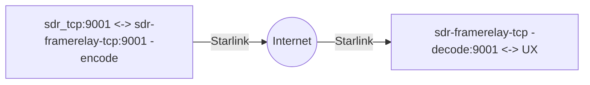

  # sdr-framerelay-tcp

The common idea is to compress sdr data during the transport over internet and don't touch cmd channel.
Thus, we have two different configuration at the transport ends - encode from remote end and decode on the local:

>remote end[sdr_tcp:9001 <-> localhost:9002] (encode) <--- internet ---> client end (decode) [framerelay connect to remoteIP:9002: <-> client conneted to localhost:9001]

How to build

    go get .
    go build
    ./sdr-framerelay-tcp.go -h

  
Usage of ./sdr-framerelay-tcp:

    -algorithm string
    Compressing algorithm: 'zstd' or 'lz4' (default "zstd")
    -compress string
    Possible options: 'decode' on last hop, 'encode' on first hop, and 'no' (default "no")
    -conc int
    Concurrency: 1,2,3 (default 2)
    -connect string
    connect to IP:Port. (default "127.0.0.1:9002")
    -level string
    The compressing level. Options: Fastest (lvl 1), Default (lvl 3), Better (lvl 7), Best (lvl 11-zstd / 9-lz4) (default "Fastest")
    -listen string
    listen IP:Port. (default "0.0.0.0:9001")
